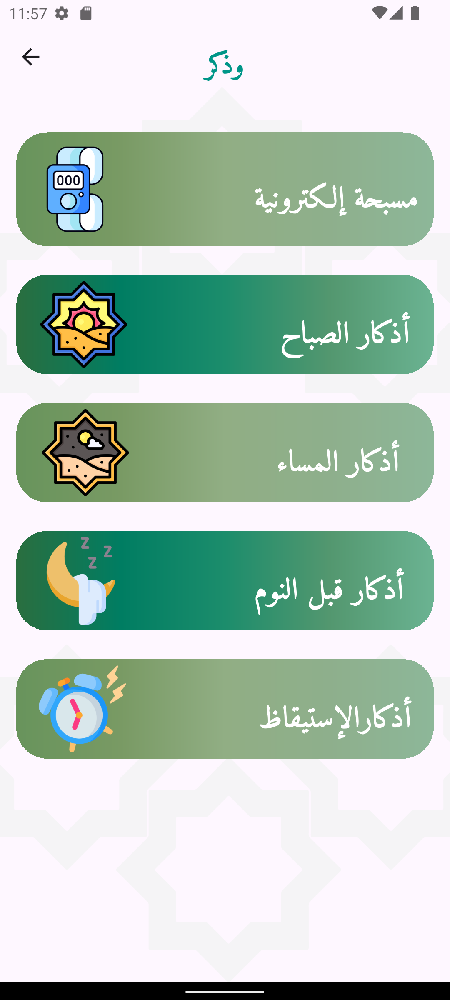
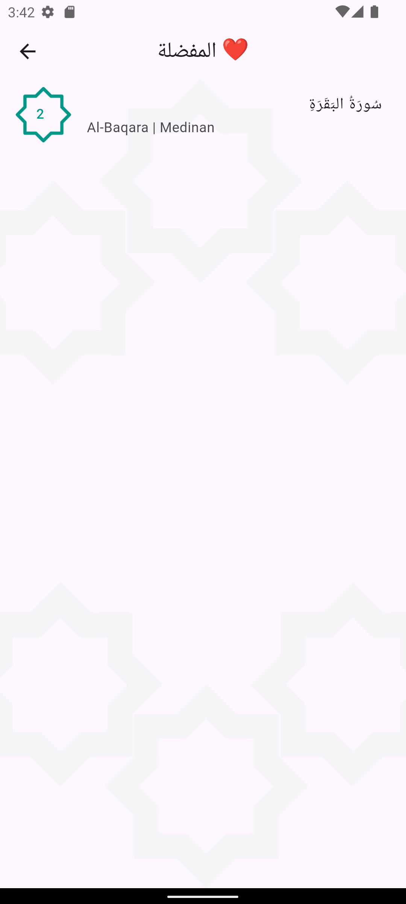
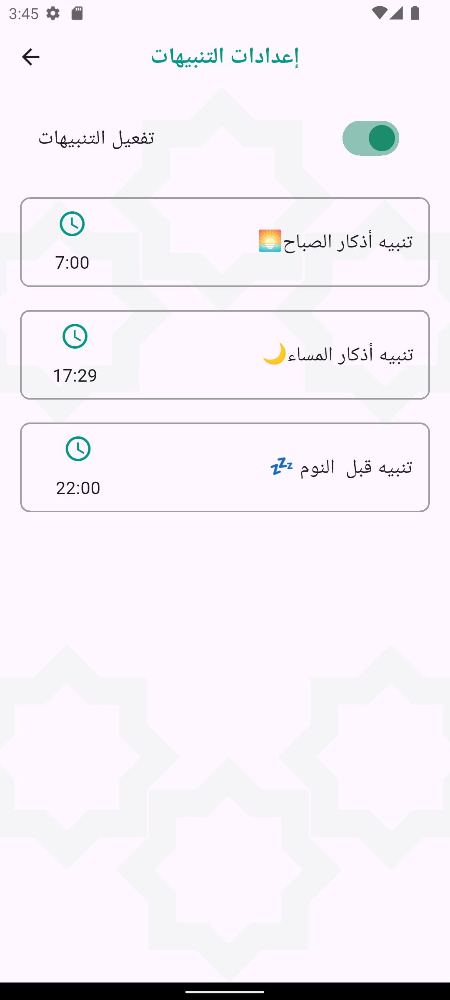

## 📱 Sajda – Qur’an, Azkar & Prayer Times

A complete Islamic mobile application built with Flutter, featuring Qur’an reading, Azkar (daily supplications), Du‘a, prayer times based on location or manual input, electronic Tasbeeh, notifications, and local storage with Hive.

## ✨ Features

📖 Qur’an: Browse Surahs, view Ayahs, and add bookmarks.

🤲 Azkar & Du‘a: Morning, evening, and before sleep supplications.

⏰ Prayer Times: Auto-detect via location or manual input using online API.

📿 Tasbeeh: Electronic counter with persistent storage using Hive.

🔔 Notifications: Daily Azkar reminders & prayer time alerts.

💾 Offline Support: Hive local database for caching Qur’an, Azkar, bookmarks, Tasbeeh, and prayer times.

🛠️ Tech Stack

- Flutter (UI framework)

- Hive (local storage & caching)

- Flutter Local Notifications (Azkar & prayer time scheduling)

- Timezone package (for accurate scheduling)

- Online APIs

- Qur’an data (e.g., AlQuran.cloud API)

- Prayer times (e.g., Aladhan API)

- Geolocator/Geocoding (for location-based prayer times)

```

📂 Project Structure
lib/
│-- main.dart
│-- core/
│   └── services/
│       └── api_service.dart
│       └── notification_service.dart
│       └── hive_service.dart
│   └── models/
│       └── surah.dart
│       └── ayah.dart
│       └── prayer_time.dart
│       └── azkar.dart
│       └── tasbeeh.dart
│-- screens/
│   └── home_screen.dart
│   └── surah_list_screen.dart
│   └── surah_detail_screen.dart
│   └── azkar_screen.dart
│   └── prayer_time_screen.dart
│   └── tasbeeh_screen.dart
│   └── bookmarks_screen.dart
│-- widgets/
│   └── custom_button.dart
│   └── custom_card.dart
│   └── surah_tile.dart

```

🚀 Getting Started
1️⃣ Prerequisites

- \*\*Flutter SDK

- \*\*A Qur’an API (e.g., AlQuran.cloud)

- \*\*A Prayer Times API (e.g., Aladhan)

2️⃣ Install Dependencies

```
 flutter pub get
```

3️⃣ Run the App

```
flutter run
```

📸 Screenshots
Qur’an Azkar Prayer Times Tasbeeh

| HomePage                     | AzkarPage                      | FavPage                    | Notifications                    |
| ---------------------------- | ------------------------------ | -------------------------- | -------------------------------- |
|  |  |  |  |

## 🔮 Future Improvements

🎧 Add audio recitation for Surahs & Azkar.

🕌 Advanced prayer time adjustments.

🍎 Full iOS support for notifications.

## 🤝 Contributing

Pull requests are welcome! For major changes, please open an issue first to discuss what you’d like to add or change.

## 📜 License

This project is licensed under the MIT License.
